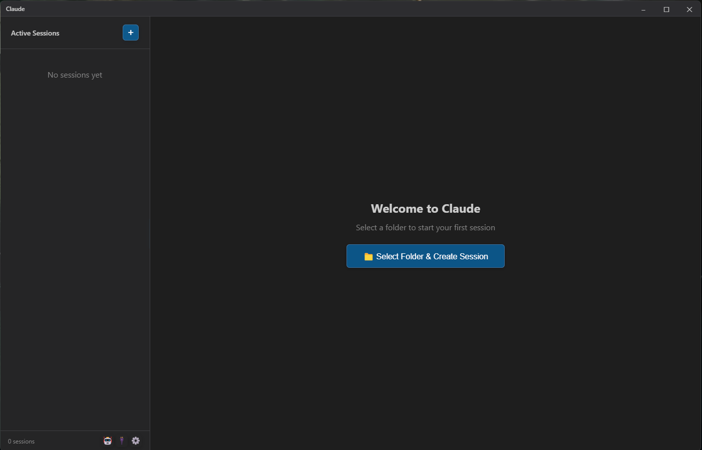
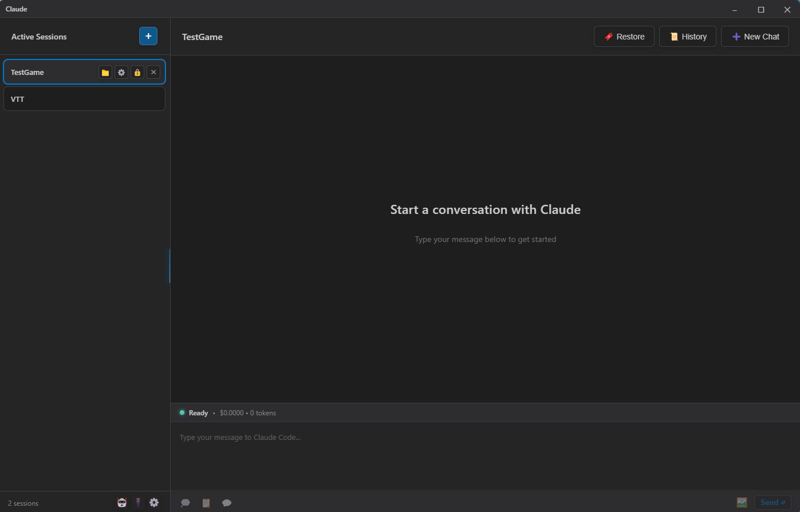
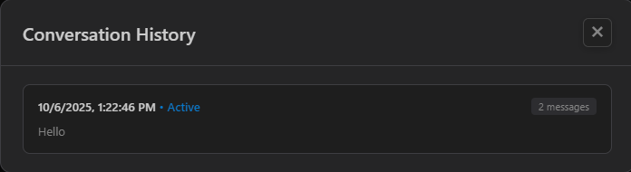
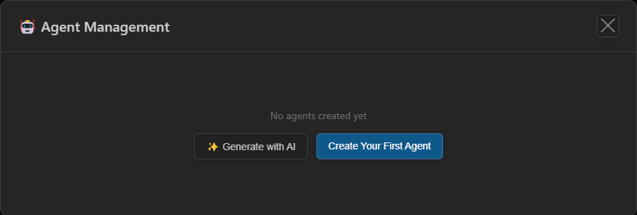
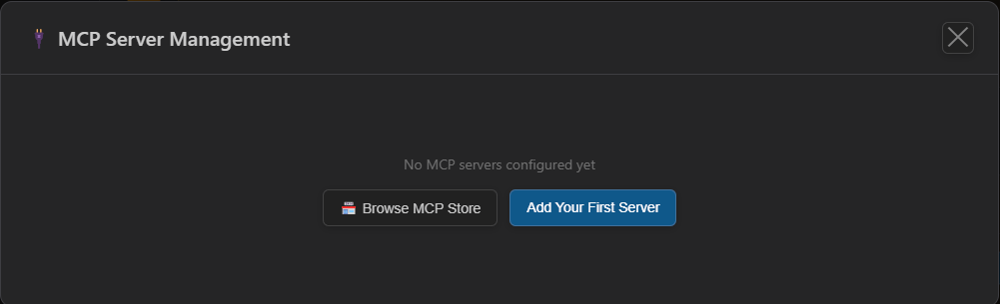
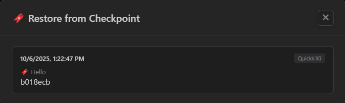
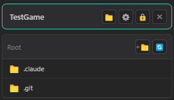

# Claude Desktop

A standalone Windows desktop application for managing multiple Claude Code CLI sessions with an advanced, feature-rich interface.

   

## Overview

Claude Desktop is a comprehensive desktop application that provides a powerful graphical interface for managing multiple Claude Code CLI sessions simultaneously. Unlike IDE-dependent solutions, this standalone application gives you complete control over multiple AI coding sessions with advanced features like permission management, git checkpoints, MCP server configuration, and more.


*Multi-session interface with sidebar, chat window, and file browser*

## Screenshots

<div align="center">

### Multi-Session Management


### Permission System


### Conversation History


### Agent Management


### MCP Server Configuration


### Git Checkpoints


### File Browser


</div>

## Key Features

### 🔀 Multi-Session Management
- **Tab-based Interface** - Work with multiple Claude sessions simultaneously, each with its own context
- **Session Persistence** - All sessions, conversations, and settings persist across app restarts
- **Independent Working Directories** - Each session operates in its own project folder
- **Model Selection per Session** - Choose different models (Opus, Sonnet, Sonnet 1M) for each session
- **Cost & Token Tracking** - Monitor usage with detailed input/output token counts and cost estimates per session

### 💬 Multi-Conversation Support
- **Multiple Conversations per Session** - Create and manage multiple conversation threads within each session
- **Conversation History Browser** - View, search, and switch between all conversations
- **Conversation Persistence** - Full message history saved and restored automatically
- **Resume from Checkpoint** - Continue any conversation exactly where you left off

### 🛡️ Advanced Permission System
- **Permission Dialogs** - Approve or deny tool usage on a per-request basis
- **Session-Specific Permissions** - Each session maintains its own permission rules
- **Always-Allow Rules** - Set up patterns to auto-approve specific tool/path combinations
- **Permission Management UI** - View and remove granted permissions at any time
- **Hook-Based Integration** - Uses Claude Code's PreToolUse hooks for seamless permission handling

### 🎯 Multiple Operating Modes
- **YOLO Mode** - Skip all permission prompts for rapid prototyping
- **Thinking Mode** - Enable extended reasoning with visible thinking blocks
- **Plan Mode** - Get detailed plans without code execution
- **No-Code Mode** - Discuss and analyze without making changes

### 📝 Slash Commands
- **Project Commands** - Commands specific to your project in `.claude/commands/`
- **Personal Commands** - Your personal commands from `~/.claude/commands/`
- **Autocomplete** - Type `/` to see available commands with descriptions
- **Command Arguments** - Support for parameterized commands

### 🤖 Agent Management
- **Create Custom Agents** - Define specialized agents with custom system prompts
- **Project & Personal Agents** - Store agents per-project or globally
- **Model Selection** - Choose specific models for each agent
- **Tool Restrictions** - Limit which tools agents can access
- **Easy Management** - Create, edit, and delete agents through a visual interface

### 🔌 MCP Server Management
- **Full MCP Support** - Configure Model Context Protocol servers
- **Multiple Server Types** - Support for stdio, HTTP, and SSE servers
- **Environment Variables** - Configure server-specific environment variables
- **Project & Personal Scope** - Manage servers at project or user level
- **Visual Configuration** - No need to manually edit JSON configs

### 📦 Git Checkpoints
- **Create Checkpoints** - Save git commits as restoration points
- **Restore to Checkpoint** - Roll back your project to any previous state
- **Checkpoint Browser** - View all checkpoints with timestamps and messages
- **Git Status Integration** - Check for uncommitted changes before operations

### 📁 Integrated File Browser
- **Sidebar File Tree** - Navigate your project files without leaving the app
- **File Operations** - Rename, delete, copy files and create folders
- **Context Menu** - Right-click for quick file operations
- **Collapsible Sidebar** - Toggle visibility for more chat space

### 🎨 Beautiful Interface
- **Modern UI Design** - Clean, professional interface with attention to detail
- **Real-time Streaming** - Watch Claude's responses appear as they're generated
- **Markdown Support** - Rich text formatting with code syntax highlighting
- **Dark & Light Themes** - Choose your preferred theme or use auto mode
- **Tool Visualization** - See tool calls, inputs, and results in formatted blocks
- **Thinking Blocks** - Collapsible reasoning blocks when thinking mode is enabled
- **Custom Title Bar** - Frameless window with integrated controls

### ⚙️ Comprehensive Settings
- **Theme Selection** - Light, dark, or automatic based on system preferences
- **Default Model** - Set your preferred model for new sessions
- **Default Directory** - Configure where new sessions start
- **WSL Support** - Configure Windows Subsystem for Linux integration
- **Global Permissions** - Set always-allow rules that apply to all sessions

## Prerequisites

- **Windows 10/11** (64-bit)
- **Claude Code CLI** - [Install from Anthropic](https://claude.com/code)
- **Node.js 18+** (for building from source)
- **Git** (optional, for checkpoint features)

## Installation

### Option 1: Download Pre-built Release (Recommended)

1. Download the latest release from the [Releases](https://github.com/your-repo/claude-desktop/releases) page
2. Run the installer (`Claude-Desktop-Setup-1.0.0.exe`)
3. Follow the installation wizard
4. Launch Claude Desktop from your Start Menu

### Option 2: Build from Source

```bash
# Clone the repository
git clone https://github.com/your-repo/claude-desktop.git
cd claude-desktop

# Install dependencies
npm install

# Development mode (with hot reload)
npm run dev

# Build for production
npm run build

# Package Windows installer
npm run package:win
```

The installer will be created in the `release/` folder.

## Usage Guide

### Getting Started

1. **Launch the Application** - Start Claude Desktop from your Start Menu
2. **Create Your First Session** - Click "Select Folder & Create Session"
3. **Choose a Working Directory** - Select the project folder where Claude will work
4. **Start Chatting** - Type your message and press Enter

### Managing Sessions

- **Create New Session** - Click the "+" button in the sidebar
- **Switch Sessions** - Click any session in the sidebar to activate it
- **Close Session** - Right-click a session and select "Close"
- **Session Settings** - Click the gear icon on a session to configure model, modes, and permissions

### Working with Conversations

Each session can have multiple conversation threads:

1. Click the **History** button to open the conversation browser
2. View all conversations with preview text and timestamps
3. Click any conversation to switch to it
4. Create a new conversation to start fresh while keeping the old one

### Managing Permissions

When Claude requests to use a tool:

1. A permission dialog appears showing the tool and target path
2. **Allow Once** - Approve this specific request
3. **Allow Always** - Create a rule to auto-approve similar requests
4. **Deny** - Reject this request
5. View/remove granted permissions in the session settings

### Using Slash Commands

1. Type `/` in the message input to see available commands
2. Select a command from the autocomplete dropdown
3. Commands can be project-specific (`.claude/commands/`) or personal (`~/.claude/commands/`)
4. Some commands accept arguments - type them after the command name

### Creating Agents

1. Click the **Agents** button in the session toolbar
2. Click **New Agent**
3. Configure the agent:
   - Name and description
   - System prompt (defines agent behavior)
   - Model preference (or inherit from session)
   - Allowed tools (optional restriction)
4. Save as project or personal scope

### Configuring MCP Servers

1. Click the **MCPs** button in the session toolbar
2. Click **Add MCP Server**
3. Configure based on server type:
   - **stdio**: Command and arguments
   - **HTTP/SSE**: URL and headers
4. Add environment variables if needed
5. Save as project or personal scope

### Using Git Checkpoints

1. Click the **Checkpoint** button to create a checkpoint
2. Enter a descriptive message
3. Claude commits all changes to git
4. To restore: click **Restore**, select a checkpoint
5. Your project rolls back to that exact state

### File Browser

- Click the **Files** icon to toggle the file browser sidebar
- Navigate folders by clicking on them
- Right-click files/folders for operations:
  - Rename
  - Delete
  - Copy
  - Create new folder

## Advanced Features

### Session Modes

Enable different modes per session in session settings:

- **YOLO Mode** - Auto-approve all permissions (use with caution!)
- **Thinking Mode** - Show Claude's reasoning process
- **Plan Mode** - Get plans without execution
- **No-Code Mode** - Discussion only, no file changes

### Cost Tracking

Each session displays:
- Total cost in USD
- Input/output token counts
- Cache creation and read tokens
- Real-time updates as you chat

### Resume Sessions

Sessions automatically save their Claude session IDs:
- Close and reopen sessions without losing context
- Continue conversations across app restarts
- Claude remembers the full conversation history

## Architecture

```
Claude Desktop
├── Main Process (Electron)
│   ├── MultiSessionManager - Session lifecycle & process management
│   ├── MessageParser - Stream data parsing
│   ├── PermissionServer - HTTP server for hook-based permissions
│   ├── PersistenceManager - Session & message storage
│   ├── CheckpointManager - Git checkpoint operations
│   ├── SlashCommandParser - Command discovery & parsing
│   ├── AgentParser - Agent configuration management
│   ├── MCPParser - MCP server configuration
│   └── ErrorHandler - Error processing & formatting
│
└── Renderer Process (React + TypeScript)
    ├── App - Main application shell
    ├── Store (Zustand) - State management
    ├── Components
    │   ├── TitleBar - Custom window controls
    │   ├── Sidebar - Session list & file browser
    │   ├── ChatWindow - Main chat interface
    │   ├── MessageList - Message rendering
    │   ├── FileTree - File browser tree
    │   ├── SettingsModal - Global settings
    │   ├── SessionSettingsModal - Per-session settings
    │   ├── PermissionDialog - Permission requests
    │   ├── HistoryModal - Conversation browser
    │   ├── RestoreModal - Checkpoint browser
    │   ├── AgentManagementModal - Agent CRUD
    │   ├── MCPManagementModal - MCP server config
    │   └── SlashCommandAutocomplete - Command completion
    └── Utils
        ├── messageFormatting - Text processing
        ├── messageRenderer - Markdown & code rendering
        └── commandHandler - Slash command processing
```

## Technology Stack

### Core
- **Electron 28** - Cross-platform desktop framework
- **React 18** - UI library with hooks
- **TypeScript 5.3** - Type-safe development
- **Vite** - Fast build tool with HMR

### State Management
- **Zustand** - Lightweight state management

### UI & Rendering
- **react-markdown** - Markdown rendering
- **react-syntax-highlighter** - Code syntax highlighting
- **CSS Modules** - Scoped styling

### Backend
- **Node.js** - Process management and file operations
- **child_process** - Claude CLI process spawning
- **fs/path** - File system operations
- **js-yaml** - YAML parsing for configs

## Configuration Files

Claude Desktop uses and creates several configuration files:

### Per-Session (in project folder)
- `.claude/settings.local.json` - Session permissions and settings
- `.claude/hooks/permission-proxy.py` - Permission hook script
- `.claude/commands/*.md` - Project slash commands
- `.claude/agents/*.md` - Project agents
- `.claude/config.json` - MCP server configurations

### Personal (in home directory)
- `~/.claude/commands/*.md` - Personal slash commands
- `~/.claude/agents/*.md` - Personal agents
- `~/.claude/config.json` - Personal MCP servers

### Application Data
- Session state and messages stored in app data directory
- Automatically managed by PersistenceManager

## Keyboard Shortcuts

| Shortcut | Action |
|----------|--------|
| `Enter` | Send message |
| `Shift+Enter` | New line in message |
| `Ctrl+,` | Open settings (planned) |
| `Ctrl+N` | New session (planned) |
| `Ctrl+W` | Close current session (planned) |

## Development

### Project Structure

```
Claude/
├── src/
│   ├── main/                    # Electron main process
│   │   ├── index.ts            # App entry point & IPC handlers
│   │   ├── MultiSessionManager.ts
│   │   ├── MessageParser.ts
│   │   ├── PermissionServer.ts
│   │   ├── PersistenceManager.ts
│   │   ├── CheckpointManager.ts
│   │   ├── SlashCommandParser.ts
│   │   ├── AgentParser.ts
│   │   ├── MCPParser.ts
│   │   ├── ErrorHandler.ts
│   │   └── preload.ts          # IPC bridge
│   ├── renderer/                # React UI
│   │   ├── App.tsx
│   │   ├── main.tsx
│   │   ├── components/
│   │   ├── store/
│   │   ├── utils/
│   │   └── styles/
│   └── shared/                  # Shared types
│       └── types.ts
├── .claude/
│   └── hooks/
│       └── permission-proxy.py  # Template permission hook
├── package.json
├── tsconfig.json
├── tsconfig.main.json
└── vite.config.ts
```

### Development Commands

```bash
# Start development server with hot reload
npm run dev

# Build main process only
npm run build:main

# Build renderer only
npm run build:renderer

# Build everything
npm run build

# Package for Windows
npm run package:win
```

### Adding New Features

1. **IPC Channels** - Add to `IPC_CHANNELS` in `types.ts`
2. **Main Process Handlers** - Implement in `src/main/index.ts`
3. **API Bindings** - Add to `preload.ts`
4. **Store Actions** - Add to `sessionStore.ts`
5. **UI Components** - Create in `src/renderer/components/`

## Troubleshooting

### Claude CLI Not Found
- Ensure Claude Code is installed and in your PATH
- Try running `claude --version` in command prompt

### Permissions Not Working
- Check that `.claude/hooks/permission-proxy.py` exists in project folder
- Verify Python is installed and accessible
- Check `.claude/settings.local.json` for correct hook configuration

### Sessions Not Persisting
- Check app data directory for corruption
- Try creating a new session
- Check file permissions on app data directory

### MCP Servers Not Connecting
- Verify server configuration in `.claude/config.json`
- Check server logs in Claude CLI stderr
- Ensure environment variables are set correctly

## Roadmap

### Version 1.1 (In Progress)
- ✅ Multi-conversation support
- ✅ Git checkpoints
- ✅ File browser
- ✅ Agent management
- ✅ MCP server management
- ✅ Slash command support
- ✅ Permission system
- ✅ Session modes (YOLO, thinking, plan, no-code)

### Version 1.2 (Planned)
- [ ] Enhanced keyboard shortcuts
- [ ] Session export/import
- [ ] Conversation search
- [ ] Diff viewer for checkpoints
- [ ] Custom themes
- [ ] Window size/position persistence
- [ ] System tray integration

### Version 2.0 (Future)
- [ ] Image support (drag & drop, paste)
- [ ] File references (@mentions)
- [ ] Inline code editing
- [ ] Side-by-side diff view
- [ ] Cross-platform support (macOS, Linux)
- [ ] Plugin system

## Known Issues

- First session creation may take a few seconds
- Very large conversation histories can impact performance
- Checkpoint restore requires clean working directory
- Window position not persisted between sessions

## Contributing

Contributions are welcome! Please feel free to submit a Pull Request.

1. Fork the repository
2. Create your feature branch (`git checkout -b feature/AmazingFeature`)
3. Commit your changes (`git commit -m 'Add some AmazingFeature'`)
4. Push to the branch (`git push origin feature/AmazingFeature`)
5. Open a Pull Request

## License

MIT License - see [LICENSE](LICENSE) file for details

## Credits

- **Claude Code** - Powered by [Anthropic's Claude CLI](https://claude.com/code)
- **Electron** - Built with the [Electron framework](https://www.electronjs.org/)

## Support

- **Issues**: [GitHub Issues](https://github.com/your-repo/claude-desktop/issues)
- **Discussions**: [GitHub Discussions](https://github.com/your-repo/claude-desktop/discussions)

---

**Built with Claude Code**
